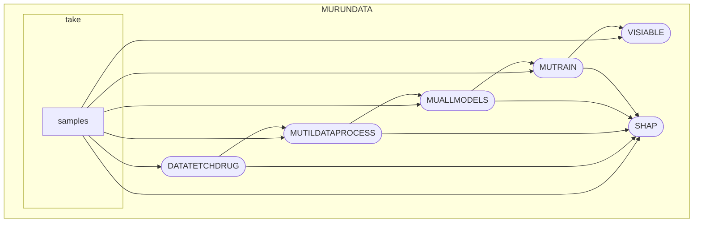

## Introduction

```mermaid
flowchart TB
    subgraph MURUNDATA
    subgraph take
    v0["samples"]
    end
    v3([DATATETCHDRUG])
    v4([MUTILDATAPROCESS])
    v5([MUALLMODELS])
    v6([MUTRAIN])
    v7([VISIABLE])
    v8([SHAP])
    v0 --> v3
    v0 --> v4
    v3 --> v4
    v0 --> v5
    v4 --> v5
    v0 --> v6
    v5 --> v6
    v0 --> v7
    v6 --> v7
    v0 --> v8
    v3 --> v8
    v4 --> v8
    v5 --> v8
    v6 --> v8
    end
```

## Usage

## Credits

## Contributions and Support

## Citations

